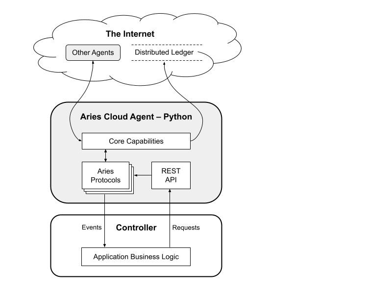

# Hyperledger Aries Cloud Agent - Python  <!-- omit in toc -->
## Clone de repositório para estudo

<!--  -->

> An easy to use Aries agent for building SSI services using any language that supports sending/receiving HTTP requests.

## Overview

Hyperledger Aries Cloud Agent Python (ACA-Py) é uma base para a construção de ecossistemas de credenciais verificáveis. Ele opera na segunda e terceira camadas da [estrutura Trust Over IP (PDF)](https://trustoverip.org/wp-content/uploads/sites/98/2020/05/toip_050520_primer.pdf) usando [mensagens DIDComm ](https://github.com/hyperledger/aries-rfcs/tree/main/concepts/0005-didcomm) e protocolos [Hyperledger Aries](https://www.hyperledger.org/use/aries). A "nuvem" no nome significa que o ACA-Py é executado em servidores (nuvem, empresa, dispositivos IoT e assim por diante) e não foi projetado para ser executado em dispositivos móveis.

O ACA-Py é construído sobre os conceitos e recursos de Aries que compõem o [Aries Interop Profile (AIP) 1.0](https://github.com/hyperledger/aries-rfcs/tree/main/concepts/0302-aries-interop- profile#aries-interop-profile-version-10) e a maioria dos recursos do [AIP 2.0](https://github.com/hyperledger/aries-rfcs/tree/main/concepts/0302-aries-interop- profile#aries-interop-profile-version-20). [Protocolos Aries suportados pelo ACA-Py](https://github.com/hyperledger/aries-cloudagent-python/blob/main/SupportedRFCs.md) incluem, mais importante, protocolos para emitir, verificar e manter credenciais verificáveis usando ambos [Hyperledger Indy AnonCreds](https://hyperledger-indy.readthedocs.io/projects/sdk/en/latest/docs/design/002-anoncreds/README.html) formato de credencial verificável e a [Credencial verificável padrão W3C] (https://www.w3.org/TR/vc-data-model/) usando JSON-LD com LD-Signatures e BBS+ Signatures.

Para usar o ACA-Py, você cria um controlador de lógica de negócios que "fala com" o ACA-Py (enviando solicitações HTTP e recebendo notificações de webhook) e o ACA-Py lida com a funcionalidade Aries e DIDComm. Esse controlador pode ser construído em qualquer linguagem que suporte fazer e receber solicitações HTTP; conhecimento de Python não é necessário. Juntos, isso significa que você pode se concentrar na criação de soluções de VC usando tecnologias familiares de desenvolvimento da Web, em vez de ter que aprender os detalhes básicos da criptografia de baixo nível e dos protocolos Aries do tipo Trust over IP.

Este [documento de visão geral em estilo de lista de verificação](./SupportedRFCs.md) fornece uma lista completa dos recursos do ACA-Py.
A seguir está uma lista de alguns dos principais recursos necessários para uma implantação de produção, com um link para informações detalhadas sobre o recurso.

### Multi-Tenant

O ACA-Py oferece suporte a cenários "multi-tenant". Nesses cenários, uma instância (escalável) de ACA-Py usa uma instância de banco de dados e juntos são capazes de gerenciar armazenamento seguro separado (para chaves privadas, DIDs, credenciais, etc.) para muitos atores diferentes. Isso permite (por exemplo) um "emissor como serviço", em que uma empresa pode ter muitos emissores de VC, cada um com identificadores diferentes, usando a mesma instância de ACA-Py para interagir com os detentores de VC conforme necessário. Da mesma forma, uma instância ACA-Py pode ser uma "carteira em nuvem" para muitos detentores (por exemplo, pessoas ou organizações) que, por qualquer motivo, não podem usar um dispositivo móvel como carteira. Saiba mais sobre implantações multi-tenant [aqui](./Multitenancy.md).

### Mediator Service

As opções de inicialização permitem o uso de um ACA-Py como um [mediador] de Áries (https://github.com/hyperledger/aries-rfcs/tree/main/concepts/0046-mediators-and-relays#summary) usando o núcleo de Áries protocolos para coordenar seu papel de mediação. Tal instância ACA-Py recebe, armazena e encaminha mensagens para agentes Aries que (por exemplo) não possuem um terminal endereçável na Internet, como uma carteira móvel. Uma instância ao vivo de um mediador público baseado em ACA-Py está disponível [aqui](https://indicio-tech.github.io/mediator/) da Indicio Technologies. Saiba mais sobre como implantar um mediador [aqui](./Mediation.md).
Em breve, um repositório Hyperledger Aries Mediator que inclui um mediador totalmente configurado pronto para implantação de produção usando ACA-Py como uma dependência.

### Indy Transaction Endorsing

ACA-Py oferece suporte a um protocolo de endosso de transação, para agentes que não têm acesso de gravação a um ledger Indy. O suporte do endossante está documentado [aqui](Endorser.md).

### Scaled Deployments

O ACA-Py oferece suporte a implantações em ambientes dimensionados, como em ambientes Kubernetes, onde o ACA-Py e seus componentes de armazenamento podem ser dimensionados horizontalmente conforme necessário para lidar com a carga.

## Example Uses

A lógica de negócios que você usa com o ACA-Py é limitada apenas pela sua imaginação. Possíveis aplicações incluem:

* Uma interface para um sistema legado para emitir credenciais verificáveis
* Um serviço de autenticação baseado na apresentação de provas de credenciais verificáveis
* Uma carteira corporativa para manter e apresentar credenciais verificáveis sobre essa empresa
* Uma interface de usuário para uma pessoa usar uma carteira não armazenada em um dispositivo móvel
* Um aplicativo embutido em um dispositivo IoT, capaz de emitir credenciais verificáveis sobre os dados coletados
* Uma conexão persistente com outros agentes que permite mensagens e notificações seguras
* Código personalizado para implementar um novo serviço.

## Getting Started

Para aqueles que são novos no SSI, Aries e ACA-Py, existem alguns cursos Linux Foundation edX que fornecem um bom ponto de partida.

* [Identidade no Hyperledger: Indy, Aries e Ursa](https://www.edx.org/course/identity-in-hyperledger-aries-indy-and-ursa)
* [Tornar-se um desenvolvedor Hyperledger Aries](https://www.edx.org/course/becoming-a-hyperledger-aries-developer)

O último é o mais útil para desenvolvedores que desejam obter uma base sólida no uso de ACA-Py e outros Aries Frameworks.

Também está incluído aqui um [Guia de primeiros passos] muito mais conciso (mas menos mantido) (/docs/GettingStartedAriesDev/README.md) que o levará de não saber quase nada sobre identidade descentralizada ao desenvolvimento de aplicativos e serviços de negócios baseados em Aries. Você executará alguns aplicativos Indy, aplicativos ACA-Py e demonstrações voltadas para desenvolvedores. O guia possui um índice para que você possa pular as partes que já conhece.

### Understanding the Architecture

Há um [webinar de mergulho profundo em arquitetura](https://www.youtube.com/watch?v=FXTQEtB4fto&feature=youtu.be) apresentado pela equipe ACA-Py e [slides do webinar](https:// docs.google.com/presentation/d/1K7qiQkVi4n-lpJ3nUZY27OniUEM0c8HAIk4imCWCx5Q/edit#slide=id.g5d43fe05cc_0_77) também estão disponíveis. A figura abaixo dá uma rápida visão geral da arquitetura, mostrando uma instância do ACA-Py, um controller e as interfaces entre o controller e o ACA-Py, e os caminhos externos para outros agentes e livros públicos na Internet.

### Installation and Usage

Uma [página "install and go" para desenvolvedores](https://github.com/hyperledger/aries-cloudagent-python/blob/main/DevReadMe.md) está disponível se você se sentir confortável com os conceitos de Trust over IP e Aries. ACA-Py pode ser executado com Docker sem instalação (altamente recomendado) ou pode ser instalado [do PyPi](https://pypi.org/project/aries-cloudagent/). No [diretório/demo](/demo) há um conjunto completo de demos para os desenvolvedores usarem para começar, e o [demo read me](/demo/README.md) é um ótimo ponto de partida para os desenvolvedores usarem uma abordagem "no navegador" para executar um exemplo de instalação zero. A visão geral [Read the Docs](https://aries-cloud-agent-python.readthedocs.io/en/latest/) também é uma maneira de fazer referência aos módulos e APIs que compõem uma instância ACA-Py.

## About the ACA-Py Admin API

A [visão geral da API do ACA-Py](https://github.com/hyperledger/aries-cloudagent-python/blob/main/AdminAPI.md) é um ótimo ponto de partida para aprender sobre a API do ACA-Py quando você estiver começando a construir seu próprio controlador.

Uma instância ACA-Py reúne uma interface REST documentada pela OpenAPI com base nos protocolos que são carregados. Isso é usado por um aplicativo controlador (escrito em qualquer linguagem) para gerenciar o comportamento do agente. O controlador pode iniciar ações (por exemplo, emitir uma credencial) e pode responder a eventos do agente (por exemplo, enviar uma solicitação de apresentação após uma conexão ser aceita). Os eventos do agente são entregues ao controlador como webhooks para uma URL configurada.

Nota técnica: a API administrativa exposta pelo agente para uso do controlador deve ser protegida com uma chave de API (usando o arg da linha de comando --admin-api-key) ou deixada deliberadamente sem segurança usando o comando --admin-insecure-mode linha arg. O último não deve ser usado além do desenvolvimento se a API não estiver protegida de outra forma.

## Troubleshooting

Existem vários recursos para obter ajuda com ACA-Py e solução de problemas
quaisquer problemas que você possa encontrar. A [Solução de problemas](Troubleshooting.md)
documento contém algumas orientações sobre problemas que foram experimentados no
passado. Sinta-se à vontade para enviar PRs para complementar o documento de solução de problemas!
Pesquisando o [ACA-Py GitHub
questões](https://github.com/hyperledger/aries-cloudagent-python/issues) irá
muitas vezes descobrem desafios que outros experimentaram, muitas vezes com respostas para
resolver esses desafios. Além disso, existe o "aries-cloudagent-python"
canal no servidor de chat Hyperledger Discord ([convite
aqui](https://discord.gg/hyperledger)).

## Credit

A implementação inicial do ACA-Py foi desenvolvida pela Equipe de Confiança Digital do Governo da Colúmbia Britânica no Canadá. Para saber mais sobre o que está acontecendo com identidade descentralizada e confiança digital na Colúmbia Britânica, um novo site será lançado e o link será disponibilizado aqui.

## Contributing

Pull requests são bem-vindos! Leia nosso [guia de contribuições](https://github.com/hyperledger/aries-cloudagent-python/blob/main/CONTRIBUTING.md) e envie seus PRs. Nós aplicamos [certificado de origem do desenvolvedor](https://developercertificate.org/) (DCO) assinatura de compromisso — [orientação](https://github.com/apps/dco) sobre isso está disponível. Também aceitamos questões enviadas sobre problemas que você encontra ao usar o ACA-Py.

## License

[Apache License Version 2.0](https://github.com/hyperledger/aries-cloudagent-python/blob/main/LICENSE)
